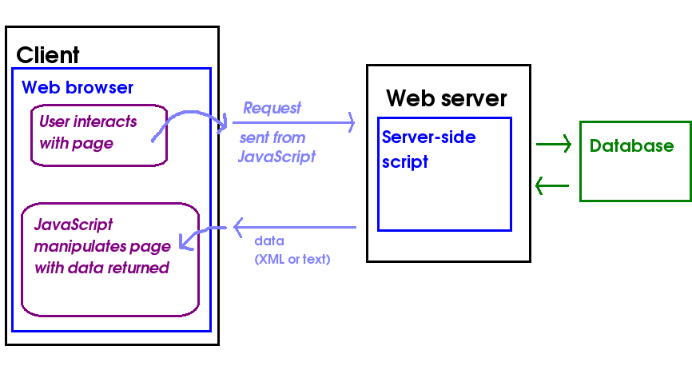

# Intro to HTTP / Client & Server 

### Objectives

*After this lesson, students will be able to:*

1. Identify parts of a URL.
1. Explain how clients and servers interact.
    - frontend vs. backend
1. Define what an API is.
    - REST, JSON, Postman

## Recap

### What did we do in Unit 1?

- front-end, or client-side, web programming
- DOM manipulation, etc.

### What wil we be doing in unit 2?

- back-end, or server-side, web programming
- interaction with 3rd-party APIs (twitter, google, Star Wars)
- database programming    


## Web Fundamentals


* scheme://domain:port/path?query_string#fragment_id

#### Example:

[http://www.google.com:80/search?q=doc+marty](http://www.google.com:80/search?q=doc+marty)

<table>
  <tr>
    <th>PROTOCOL</th>
    <th>HOST (AKA DOMAIN)</th>
    <th>PORT</th>
    <th>PATH</th>
    <th>QUERY PARAMS</th>
  </tr>
  <tr>
    <td>http://</td>
    <td>www.google.com</td>
    <td>:80</td>
    <td>/search</td>
    <td>?q=doc++marty</td>
  </tr>
</table>

#### Why use a query string?

#### Curl demo - jQuery & Google (5 min)

## Client/Server interaction

A client is any application on a computer (or phone, or car, etc.) that can *request* a resource from a server. The server is any application that can respond to those requests.

> What's curl?
>Curl is a command line tool for transferring data.


Run the following command in your terminal:

`curl www.google.com`

`curl http://wttr.in/New`

While there are many different client applications capable of requesting resources from server applications, the client we'll primarily be using is the web browser.


## What is an API?

1. **Long Version**: API stands for Application Programming Interface. It's a set of tools, software, instructions, etc that allows you to interact or create software with an external system. It describes how to use a piece of software that someone else has built. 

1. **Short Version:** An API is a set of tools and protocols for interacting with software.

### Have we already used an API?

Examples of API's:
 1. The DOM
   -  A lot of the JavaScript we write in the web browser uses the DOM API, that is, it uses the browser's API to make the DOM do things:
   - Example: when a button is clicked, we can change the font color to red. To do all of that we have to interact with the DOM.
 2. Apple provides API's to developers that allows them to interact with OSX.
 3. Google Maps
  - Allows developers to embed Google Maps into their applications.

## XML and JSON: dialects of data

How is data transferred on the web? How do APIs transfer data?

### Example XML (Extensible Markup Language)

```xml
<guestbook>
  <guest>
    <fname>Terje</fname>
    <lname>Beck</lname>
  </guest>
  <guest>
    <fname>Jan</fname>
    <lname>Refsnes</lname>
  </guest>
  <guest>
    <fname>Torleif</fname>
    <lname>Rasmussen</lname>
  </guest>
  <guest>
    <fname>anton</fname>
    <lname>chek</lname>
  </guest>
  <guest>
    <fname>stale</fname>
    <lname>refsnes</lname>
  </guest>
</guestbook>
```

- XML is fairly annoying to work with, so we'll be using JSON for the APIs we build and all of the 3rd party APIs we work with.

### Example JavaScript Object Notation (JSON)

- JSON is basically the combination of arrays and objects.
- It allows you to store collections of objects.
- Derived from Javascript, but is language independent. 
  - Many languages have developed ways to create and parse JSON.

```json
{
  "firstname": "Dominic",
  "lastname": "Farquharson",
  "role": "Instructional Associate",
  "pets": [
    {
      "name": "Sassy",
      "type": "Cat",
      "favorite_activity": "sleeping",
      "age": 10
    },
    {
      "name": "Rhaegar",
      "type": "Dragon",
      "favorite_toy": "People",
      "age": 5
    }
  ],
  "favorite_number": 10
};
```

- more on JSON: [w3 schools](https://www.w3schools.com/js/js_json_intro.asp)

## What is AJAX? - Fun part

- AJAX stands for Asynchronous JavaScript and XML. It was named a long time ago, it is not in any way limited to XML.
- It is a way to communicate with a back-end service after the page has already loaded, hence the "asynchronous" part.

AJAX adds for a much better user experience. 

1. Does the entire page refresh when a comment is liked on Facebook?

1. Does the entire page refresh when you click `view more` to read a comment.

1. How is Ajax helpful?


### AJAX Diagram


*This happens w/o the page refreshing!*


### RESTful Paradigm

- REST stands for Representational State Transfer.
- It is a convention for writing back-end services in that it maps HTTP request types to specific server-side actions:
	- POST -> Create
	- GET -> Read
      - default action in a web browser.
	- PUT -> Update
	- DELETE -> Destroy
- POST, GET, PUT, and DELETE are often called HTTP verbs. There are others but these 4 are the most common.
- AJAX can trigger each of these request types to perform different operations on the server.

## Postman

- [Download Postman here](https://www.getpostman.com/)
- "A powerful GUI platform to make your API development faster & easier, from building API requests through testing, documentation and sharing."

## LAB: Play around with Postman (20 min)

[Use Postman to practice getting data from the Game of Thrones API.](https://git.generalassemb.ly/wdi-nyc-thundercats/LAB_U02_D01_JSON-Practice)


## Additional Resources
1. [REST](http://www.restapitutorial.com/lessons/whatisrest.html)
1. [What is an API?](https://stackoverflow.com/questions/7440379/what-exactly-is-the-meaning-of-an-api)
1. [URL](https://stackoverflow.com/questions/4913343/what-is-the-difference-between-uri-url-and-urn)
1. [JSON](http://json.org/)


